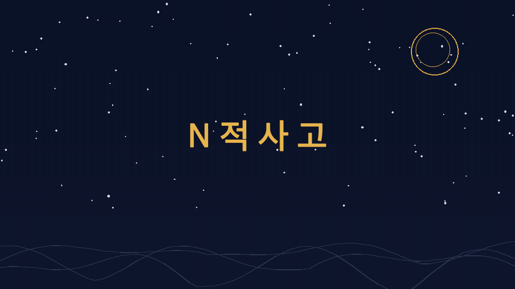

# N적사고 — 균형 꿈해몽

하나의 꿈을 **N개의 해석 가설**로 펼치고, 전통 해몽 문헌의 근거와 일치도를 계산해 **길 · 흉 · 혼합 · 중립 · 판정 유보** 중 하나로 투명하게 판정하는 꿈해몽 웹 서비스입니다. 미래를 맞히는 서비스가 아니라, 제각각인 해몽을 근거와 함께 정리해 주는 서비스입니다.

**▶ 사용해 보기: https://loveevalee.github.io/njeoksago-web/**

## 동작 원리

1. **추출** — 꿈 문장에서 상징(언어 모델 또는 경량 패턴 매처)과 장면 전개(행동·결말·감정)를 읽어냅니다. 추출까지만 — 해석을 지어내지 않습니다.
2. **근거 매칭** — 전통 해몽 문헌에서 구조화한 규칙(knowledge base)과 대조해, 조건 일치도와 계보 간 합의 등급을 계산합니다.
3. **판정** — 길·흉 근거의 총량과 균형(balance)을 **결정적 코드**가 계산합니다. 근거가 얇으면 억지로 정하지 않고 판정을 유보합니다.

## 원칙

- **LLM은 추출, 판정은 코드** — 같은 꿈은 언제나 같은 판정이 나옵니다.
- **근거 없는 단정 금지** — 모든 판정 화면에 근거 목록과 일치도가 그대로 공개됩니다.
- **한쪽으로 몰지 않음** — 길·흉 근거가 함께 있으면 혼합으로 두고, 갈리는 계보는 갈린다고 보여줍니다.
- **지식베이스는 사람 검수 게이트를 거쳐서만 갱신**됩니다.

## 이 저장소

배포용 정적 앱(`index.html`)과 판정 지식 스냅샷(`kb.json`)만 담고 있습니다. 지식베이스 원천 데이터와 수집 파이프라인은 비공개입니다.
